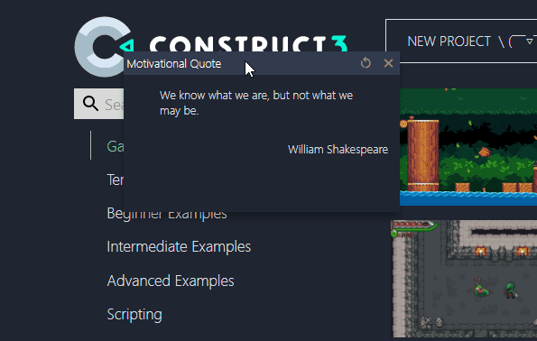

# Motivational quotes for c3 (with Svelte)

*Shows a motivational quote when you launch Construct 3.*


## Get started

*Note that you will need to have [Node.js](https://nodejs.org) installed.*

Go to the folder

```bash
cd .\chrome-extension\
```

Install the dependencies...

```bash
npm install
```

...then start [Rollup](https://rollupjs.org):

```bash
npm run dev
```

## Building and running in production mode

To create a version of the app:

```bash
npm run build
```